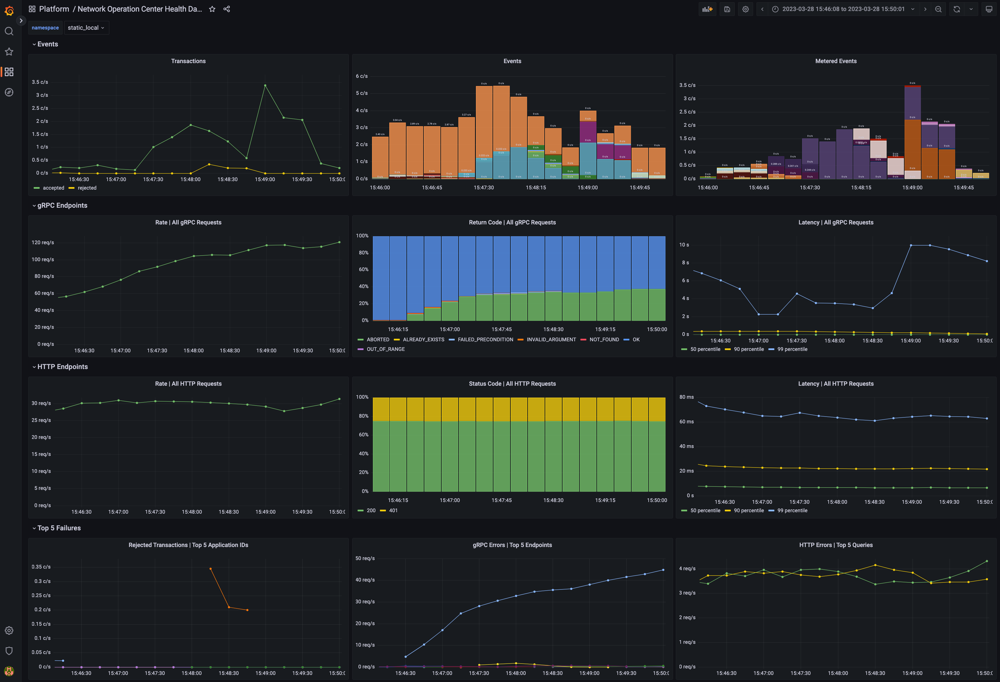

# Daml Enterprise - Observability Example

This project demonstrates a [Daml Enterprise](https://www.digitalasset.com/products/daml-enterprise)
deployment's observability features, along with example Grafana dashboards.

The project is self-contained: providing scripts to generate requests for
which metrics are collected for display in the Grafana dashboards. It requires
Daml `2.6.5` or newer and has been tested on MacOS and Linux.

**This project is provided for illustrative purposes only, the various configurations
are tailored for local run and may not fit other use cases.**

**This repository does not accept contributions at the moment.**

Use the `Makefile` — run `make help` for available commands!

## 🚦 Prerequisites 🚦

* [**Docker**](https://docs.docker.com/get-docker/)
* [**Docker Compose V2 (as plugin `2.x`)**](https://github.com/docker/compose)
* (Optional) Digital Asset Artifactory credentials to access private [Daml Enterprise container images](#accessing-daml-enterprise-container-images)

⚠️ **Docker compose V1 is deprecated and incompatible with this project**, check [Docker documentation](https://docs.docker.com/compose/migrate/).
One sign you are using the wrong version is the command syntax with a dash instead of a space:
`docker compose` (V2 ✔️) VS `docker-compose` (V1 ❌).

Docker Compose will automatically build the [image for the HTTP JSON API service](./daml-service/)
from the release JAR file.

The [`.env`](./.env) file has environment variables to select which Canton and Daml SDK versions
are being used. See [this section below](#accessing-daml-enterprise-container-images) for more details.
Please be aware that using a different Daml Enterprise version may not generate all the metrics used in
the Grafana dashboards, some things may not show up.

## Quickstart

To quickly get up and running, **make sure you have all the prerequisites installed** and then:

* Ensure you have enough CPU/RAM/disk to run this project; if resource limits are reached, a container can be killed.
Canton can use over 4GB of RAM for example.
* Start everything: `docker compose up`
* Create workload: there are various scripts that generate load, run them in different terminals:
  * `scripts/generate-load.sh` (generates gRPC traffic to the Ledger API running the conformance tests in loop)
  * `scripts/send-json-api-requests.sh` (generates HTTP traffic to the [HTTP JSON API Service](https://docs.daml.com/json-api/))
  * `scripts/send-trigger-requests.sh` (generates HTTP traffic to the [Trigger Service](https://docs.daml.com/tools/trigger-service/))
* Log in to the Grafana at [http://localhost:3000/](http://localhost:3000/) using the default
user and password `digitalasset`. After you open any dashboard, you can lower the time range to 5 minutes and
refresh to 10 seconds to see results quickly.
* When you stop, it is recommended to [cleanup everything](#cleanup-everything) and start fresh next time:
`docker compose down -v`

The "Operation Center" dashboard should look like this:



## Components

Docker Compose will start the following services:

* PostgreSQL database server
* Daml Platform
  * All-in-one Canton node (domain topology manager, mediator, sequencer and participant)
  * HTTP JSON API service
  * Trigger service
* Monitoring
  * Prometheus `2.x`
  * Grafana `9.x`
  * Node Exporter
  * Loki + Promtail `2.x`

Prometheus and Loki are [preconfigured as datasources for Grafana](./grafana/datasources.yml). You can add other
services/exporters in the [Docker compose file](./docker-compose-observability.yml) and scrape them changing the
[Prometheus configuration](./prometheus/prometheus.yml).

## Startup

Start everything (blocking command, show all logs):

```sh
docker compose up
```

Start everything (detached: background, not showing logs)

```sh
docker compose up -d
```

If you see the error message `no configuration file provided: not found`
please check that you are placed at the root of this project.

### Starting a Remote Canton Console

```sh
docker exec -it daml_observability_canton_console bin/canton -c /canton/config/console.conf
```

## Stopping

* If you used a blocking `docker compose up`, just cancel via keyboard with `[Ctrl]+[c]`

* If you detached compose: `docker compose down`

### Cleanup Everything

Stop everything, remove networks and all Canton, Prometheus & Grafana data stored in volumes:

```sh
docker compose down --volumes
```

## Important Endpoints to Explore

* Prometheus: http://localhost:9090/
* Grafana: http://localhost:3000/ (default user and password: `digitalasset`)
* Participant's Ledger API endpoint: http://localhost:10011/
* HTTP JSON API endpoint: http://localhost:4001/

Check all exposed services/ports in the different [Docker compose YAML] files:
* [Canton](./docker-compose-canton.yml)
* [Daml services](./docker-compose-daml-services.yml)
* [Observability stack](./docker-compose-observability.yml)

### Canton Console

```sh
docker exec -it daml_observability_canton_console bin/canton -c /canton/config/console.conf
```

### Logs

```sh
docker logs daml_observability_postgres
docker logs daml_observability_prometheus
docker logs daml_observability_grafana
```
You can open multiple terminals and follow logs (blocking command) of a specific container:

```
docker logs -f daml_observability_postgres
docker logs -f daml_observability_prometheus
docker logs -f daml_observability_grafana
```

You can query Loki for logs [using Grafana in the `Explore` section](http://localhost:3000/explore?left=%7B%22datasource%22:%22loki%22%7D).

### Metrics

You can query Prometheus for metrics [using Grafana in the `Explore` section](http://localhost:3000/explore?left=%7B%22datasource%22:%22prometheus%22%7D).

## Configuration

### Canton and HTTP JSON API Log Level

For the Canton node and HTTP JSON API service only, you can change `LOG_LEVEL` in the [`.env`](./.env) file:

```sh
LOG_LEVEL=DEBUG
```

### Prometheus

[`prometheus.yml`](./prometheus/prometheus.yml) [[documentation]](https://prometheus.io/docs/prometheus/latest/configuration/configuration/)

Reload or restart on changes:
* Reload:
  * Signal: `docker exec -it daml_observability_prometheus -- kill -HUP 1`
  * HTTP: `curl -X POST http://localhost:9090/-/reload`
* Restart: `docker compose restart prometheus`

### Grafana

* Grafana itself: [`grafana.ini`](./grafana/grafana.ini) [[documentation]](https://grafana.com/docs/grafana/latest/setup-grafana/configure-grafana/)
* Data sources: [`datasources.yml`](./grafana/datasources.yml) [[documentation]](https://grafana.com/docs/grafana/latest/datasources/)
* Dashboard providers: [`dashboards.yml`](./grafana/dashboards.yml) [[documentation]](https://grafana.com/docs/grafana/latest/administration/provisioning/#dashboards)

Restart on changes: `docker compose restart grafana`

#### Dashboards

All dashboards (JSON files) are auto-loaded from directory
[`grafana/dashboards/`](./grafana/dashboards/)

* Automatic: place your JSON files in the folder (loaded at startup, reloaded every 30 seconds)
* Manual: create/edit via Grafana UI

### Loki

* Loki itself: [`loki.yaml`](./loki/loki.yaml) [[documentation]](https://grafana.com/docs/loki/latest/configure/)

Restart on changes: `docker compose restart loki`

* Promtail: [`promtail.yaml`](./loki/promtail.yaml) [[documentation]](https://grafana.com/docs/loki/latest/send-data/promtail/configuration/)

Restart on changes: `docker compose restart promtail`

##### Examples Source

* Prometheus and Grafana [[source]](https://github.com/grafana/grafana/tree/main/public/app/plugins/datasource/prometheus/dashboards/)
* Node exporter full [[source]](https://grafana.com/grafana/dashboards/1860-node-exporter-full/)
* Loki and Promtail [[source]](https://grafana.com/grafana/dashboards/14055-loki-stack-monitoring-promtail-loki/)

## Accessing Daml Enterprise container images

* Get credentials from Digital Asset support. You can get an access key by logging
in to [digitalasset.jfrog.io](https://digitalasset.jfrog.io) and generating an identity token in your [Artifactory profile
page](https://digitalasset.jfrog.io/ui/admin/artifactory/user_profile). If your email is john.doe@digitalasset.com,
your Artifactory username is `john.doe`.

* Log in to Digital Asset's Artifactory at `digitalasset-docker.jfrog.io`, you will be prompted for the password,
use your identity token:

```sh
docker login digitalasset-docker.jfrog.io -u <username>
```

* Set the [`.env`](./.env) file environment variables `CANTON_IMAGE` and `CANTON_VERSION` to the version you want.

### ```.env``` example configurations

* Using Daml open-source public container images (default), pulled from Docker Hub:

```sh
CANTON_IMAGE=digitalasset/canton-open-source
CANTON_VERSION=2.6.5
SDK_VERSION=2.6.5
LOG_LEVEL=INFO
```

* Using [Daml Enterprise](https://www.digitalasset.com/products/daml-enterprise) private container images, pulled from
Digital Asset's Artifactory:

```sh
CANTON_IMAGE=digitalasset-docker.jfrog.io/digitalasset/canton-enterprise
CANTON_VERSION=2.6.5
SDK_VERSION=2.6.5
LOG_LEVEL=INFO
```

## Extras

The following optional services are also available:

* Participant Query Store (PQS)

To launch these additional services, follow these steps:

1. Launch the other services, as described in the previous sections.
2. Run the following script, which is required because the DARs must be uploaded _before_ starting the PQS.  
   ```
   scripts/upload-test-dars.sh
   ```
3. Run the following script, which is required because the parties must be created _before_ starting the PQS.  
   ```
   scripts/generate-load.sh 1 --concurrent-test-runs 1 --include TransactionService
   ```
4. Run the following to launch the optional services:
   ```
   docker compose --file docker-compose-extras.yml up --detach
   ```
5. Explore the PQS database at <http://localhost:8085>, logging in with:
   * System: `PostgreSQL`
   * Server: `postgres`
   * Username: `canton`
   * Password: `supersafe`
   * Database: `pqs`
6. To shutdown these optional containers, run the following:  
   ```
   docker compose --file docker-compose-extras.yml down
   ```

## License

**You may use the contents of this repository in parts or in whole according to the `0BSD` license.**

Copyright &copy; 2023 Digital Asset (Switzerland) GmbH and/or its affiliates

> Permission to use, copy, modify, and/or distribute this software for
> any purpose with or without fee is hereby granted.
> 
> THE SOFTWARE IS PROVIDED “AS IS” AND THE AUTHOR DISCLAIMS ALL
> WARRANTIES WITH REGARD TO THIS SOFTWARE INCLUDING ALL IMPLIED WARRANTIES
> OF MERCHANTABILITY AND FITNESS. IN NO EVENT SHALL THE AUTHOR BE LIABLE
> FOR ANY SPECIAL, DIRECT, INDIRECT, OR CONSEQUENTIAL DAMAGES OR ANY
> DAMAGES WHATSOEVER RESULTING FROM LOSS OF USE, DATA OR PROFITS, WHETHER IN
> AN ACTION OF CONTRACT, NEGLIGENCE OR OTHER TORTIOUS ACTION, ARISING OUT
> OF OR IN CONNECTION WITH THE USE OR PERFORMANCE OF THIS SOFTWARE.
